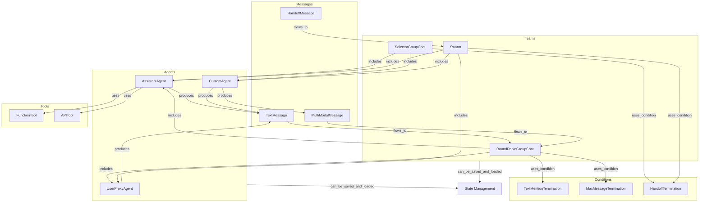
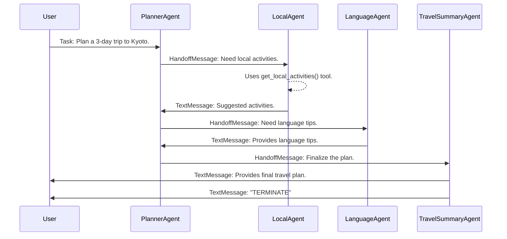
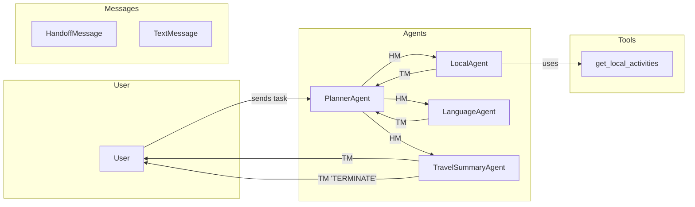

Autogen Components Relationship Diagram

```mermaid
graph TD
    subgraph Agents
        A[AssistantAgent]
        U[UserProxyAgent]
        C[CustomAgent]
    end
    subgraph Messages
        T[TextMessage]
        M[MultiModalMessage]
        H[HandoffMessage]
    end
    subgraph Teams
        R[RoundRobinGroupChat]
        S[SelectorGroupChat]
        W[Swarm]
    end
    subgraph Conditions
        TM[TextMentionTermination]
        MM[MaxMessageTermination]
        HT[HandoffTermination]
    end
    subgraph Tools
        F1[FunctionTool]
        F2[APITool]
    end
    A -- produces --> T
    A -- uses --> F1
    A -- uses --> F2
    U -- produces --> T
    C -- produces --> T
    C -- produces --> M
    T -- flows_to --> R
    M -- flows_to --> R
    H -- flows_to --> W
    R -- includes --> A
    R -- includes --> U
    R -- uses_condition --> TM
    R -- uses_condition --> MM
    S -- includes --> A
    S -- includes --> C
    S -- uses_condition --> HT
    W -- includes --> A
    W -- includes --> C
    W -- includes --> U
    W -- uses_condition --> HT
    Agents -- can_be_saved_and_loaded --> State[State Management]
    Teams -- can_be_saved_and_loaded --> State
```

Agents Interaction Flow in a Swarm

```mermaid
sequenceDiagram
    participant User
    participant Planner as PlannerAgent
    participant Local as LocalAgent
    participant Language as LanguageAgent
    participant Summary as TravelSummaryAgent

    User->>Planner: Task: Plan a 3-day trip to Kyoto.
    Planner->>Local: HandoffMessage: Need local activities.
    Local-->>Local: Uses get_local_activities() tool.
    Local->>Planner: TextMessage: Suggested activities.
    Planner->>Language: HandoffMessage: Need language tips.
    Language->>Planner: TextMessage: Provides language tips.
    Planner->>Summary: HandoffMessage: Finalize the plan.
    Summary->>User: TextMessage: Provides final travel plan.
    Summary->>User: TextMessage: "TERMINATE"
```

Components Interaction Overview

```mermaid
flowchart LR
    subgraph User
        U[User]
    end
    subgraph Agents
        P[PlannerAgent]
        L[LocalAgent]
        Lang[LanguageAgent]
        S[TravelSummaryAgent]
    end
    subgraph Tools
        GLA[get_local_activities]
    end
    subgraph Messages
        HM[HandoffMessage]
        TM[TextMessage]
    end
    U -->|sends task| P
    P -->|HM| L
    L -->|uses| GLA
    L -->|TM| P
    P -->|HM| Lang
    Lang -->|TM| P
    P -->|HM| S
    S -->|TM| U
    S -->|TM 'TERMINATE'| U
```

