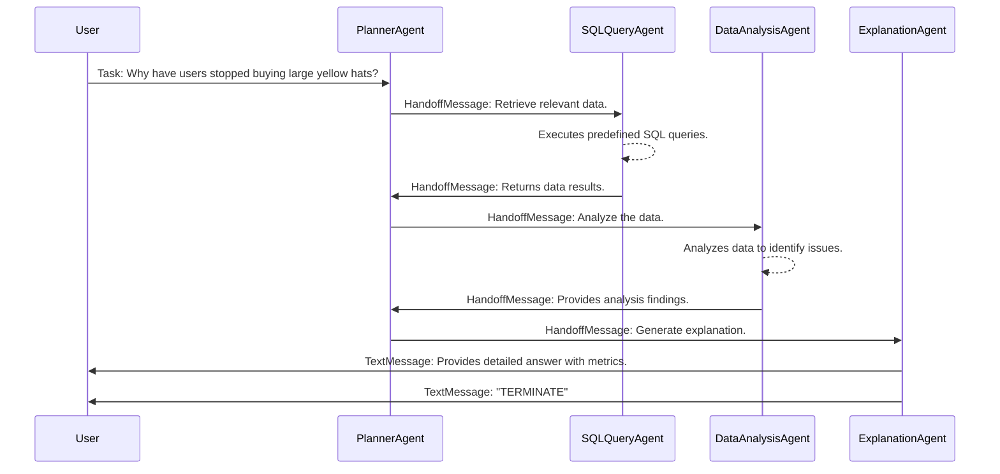

Agents Interaction Flow in a Swarm Using Handoff Approach



## Explanation

User sends a natural language query to `PlannerAgent`.
`PlannerAgent` delegates the task by handing off to `SQLQueryAgent` to retrieve relevant data using predefined SQL query templates.
`SQLQueryAgent` executes the queries, fetches the data, and hands off the results back to `PlannerAgent`.
`PlannerAgent` then hands off to `DataAnalysisAgent` to analyze the retrieved data and identify potential reasons for the decline in sales.
`DataAnalysisAgent` analyzes the data, finds insights, and hands off the findings back to `PlannerAgent`.
`PlannerAgent` then hands off to `ExplanationAgent` to generate a clear and comprehensive explanation for the user, utilizing the metrics and reasoning derived from the analysis.
`ExplanationAgent` provides the detailed answer to the User and signals the end of the conversation by sending "TERMINATE".

## Components and Tools

### Agents:
- `PlannerAgent`: Coordinates the workflow, delegates tasks to specialized agents.
- `SQLQueryAgent`: Prepares and executes SQL queries using predefined templates.
- `DataAnalysisAgent`: Analyzes data to extract insights and identify issues.
- `ExplanationAgent`: Generates a clear explanation based on the analyzed data.

### Tools:
- `ExecuteSQLQuery`: Used by `SQLQueryAgent` to run SQL queries.
- `DataAnalysisTool`: Used by `DataAnalysisAgent` to perform data analytics.

### Messages:
- `HandoffMessage`: Used to transfer control and data between agents.
- `TextMessage`: Used to communicate with the user.

## Mermaid Diagram Code


## Workflow Description

### User Initiation
The user poses a complex question regarding a decline in sales of a specific product.

### Planning Phase
- **PlannerAgent** assesses the request and determines the necessary steps.
- Decides to retrieve relevant data and perform analysis before generating an explanation.

### Data Retrieval
- **PlannerAgent** hands off the task to **SQLQueryAgent** via a `HandoffMessage`.
- **SQLQueryAgent** uses predefined SQL query templates to prepare and execute queries related to:
  - User retention
  - Page view time
  - Time-to-purchase
  - Number of products viewed
  - Specific focus on large yellow hats
- Collects the resulting data.

### Data Return
- **SQLQueryAgent** hands off the data back to **PlannerAgent** through a `HandoffMessage` containing the query results.

### Data Analysis
- **PlannerAgent** delegates the analysis to **DataAnalysisAgent** via another `HandoffMessage`.
- **DataAnalysisAgent** processes the data to identify trends, anomalies, or issues that could explain the drop in sales.
  - Possible findings might include increased page load times, negative user reviews, decreased visibility of the product, etc.

### Analysis Return
- **DataAnalysisAgent** returns the insights to **PlannerAgent** using a `HandoffMessage`.

### Explanation Generation
- **PlannerAgent** hands off the task to **ExplanationAgent**.
- **ExplanationAgent** crafts a detailed explanation for the user, incorporating the metrics and reasoning from the analysis.
  - Explains the observed metrics and provides possible reasons such as market trends, competition, or website issues.

### Final Response
- **ExplanationAgent** sends the final answer to the User via a `TextMessage`.
- Signals the end of the conversation by sending "TERMINATE".

## Benefits of Using Swarm Handoff Approach
- **Modularity**: Each agent specializes in a specific task, making the system easier to maintain and extend.
- **Scalability**: New agents can be added for additional functionalities (e.g., MarketingAnalysisAgent).
- **Clarity**: Handoffs make the flow of information explicit, improving traceability.
- **Reusability**: Agents can be reused in different workflows or applications.

## Implementing with Autogen Framework

### Define Agents
Create `AssistantAgent` instances for each agent, specifying their `system_message`, tools, and handoffs.

### Set Up Tools
Implement the SQL execution and data analysis functions. Wrap them with `FunctionTool` if needed.

### Create Swarm
Instantiate a `Swarm` team with all the agents. Define the `termination_condition` using `TextMentionTermination("TERMINATE")`.

### Run the Swarm
Use `team.run_stream(task=...)` to execute the workflow. Handle any `HandoffMessage` that requires user input if necessary.

### Example Code Snippet

```python
from autogen_agentchat.agents import AssistantAgent
from autogen_agentchat.messages import HandoffMessage
from autogen_agentchat.teams import Swarm
from autogen_agentchat.conditions import TextMentionTermination
from autogen_ext.models.openai import OpenAIChatCompletionClient

# Define tools (implement execute_sql_query and analyze_data functions)
def execute_sql_query(query_name: str) -> dict:
    # Implementation to execute the SQL query and return results
    pass

def analyze_data(data: dict) -> dict:
    # Implementation to analyze data and return findings
    pass

# Define agents
planner_agent = AssistantAgent(
    name="PlannerAgent",
    model_client=OpenAIChatCompletionClient(model="gpt-4o"),
    handoffs=["SQLQueryAgent", "DataAnalysisAgent", "ExplanationAgent"],
    system_message="Coordinate the workflow to answer the user's question."
)

sql_query_agent = AssistantAgent(
    name="SQLQueryAgent",
    model_client=OpenAIChatCompletionClient(model="gpt-4o"),
    tools=[execute_sql_query],
    handoffs=["PlannerAgent"],
    system_message="Execute predefined SQL queries to retrieve relevant data."
)

data_analysis_agent = AssistantAgent(
    name="DataAnalysisAgent",
    model_client=OpenAIChatCompletionClient(model="gpt-4o"),
    tools=[analyze_data],
    handoffs=["PlannerAgent"],
    system_message="Analyze data to find insights."
)

explanation_agent = AssistantAgent(
    name="ExplanationAgent",
    model_client=OpenAIChatCompletionClient(model="gpt-4o"),
    handoffs=[],
    system_message="Generate a clear explanation based on the analysis."
)

# Set up the swarm
termination = TextMentionTermination("TERMINATE")
team = Swarm(
    participants=[planner_agent, sql_query_agent, data_analysis_agent, explanation_agent],
    termination_condition=termination
)

# Run the swarm
await Console(
    team.run_stream(
        task="Why have users stopped buying large yellow hats?"
    )
)

```

This architecture ensures each component is responsible for a single aspect of the problem, promoting clean code and easier debugging. The Swarm model with handoffs allows for flexible and dynamic task delegation among agents, closely mirroring complex workflows in real-world applications.
 
This diagram and explanation should help you visualize how to implement the Swarm Handoff approach in an application using the Autogen framework for the given scenario.

