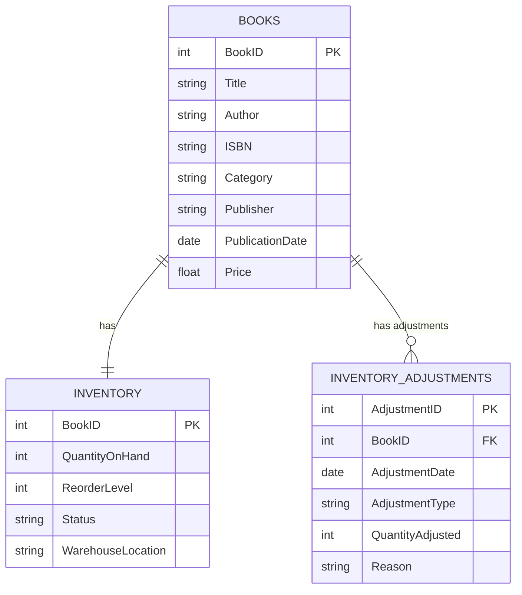

I want to make a toy example of a database for a Bookkeeping Store to manage the inventory, including the ability to handle excess and obsolete inventory.

**Tables and Relationships:**

1. **BOOKS**: This table stores information about each book available in the store.
2. **INVENTORY**: This table keeps track of the quantity of each book on hand, reorder levels, and warehouse locations.
3. **INVENTORY_ADJUSTMENTS**: This table records any adjustments made to the inventory, such as new shipments or obsolescence write-offs.

**Relationships:**

- Each book in the `BOOKS` table has one corresponding inventory record in the `INVENTORY` table.
- A book can have zero or more inventory adjustments recorded in the `INVENTORY_ADJUSTMENTS` table.

With this correction, the Mermaid ER diagram should parse correctly and visually represent the database structure you described.

**Explanation of the Tables:**

- **BOOKS**:
  - **BookID**: A unique identifier for each book (Primary Key).
  - **Title**, **Author**, **ISBN**, **Category**, **Publisher**, **PublicationDate**, **Price**: Additional details about the book.

- **INVENTORY**:
  - **BookID**: References the `BookID` from `BOOKS` (Primary Key and Foreign Key implicitly through the relationship).
  - **QuantityOnHand**: The current stock level.
  - **ReorderLevel**: The stock level at which more units should be ordered.
  - **Status**: Indicates if the book is active, discontinued, or obsolete.
  - **WarehouseLocation**: The physical location of the book in the warehouse.

- **INVENTORY_ADJUSTMENTS**:
  - **AdjustmentID**: A unique identifier for each inventory adjustment (Primary Key).
  - **BookID**: References the `BookID` from `BOOKS` (Foreign Key).
  - **AdjustmentDate**: The date of the inventory adjustment.
  - **AdjustmentType**: The type of adjustment (e.g., addition, subtraction, write-off).
  - **QuantityAdjusted**: The number of units adjusted.
  - **Reason**: A description or reason for the adjustment.

[//]: # (Please write creation SQL scripts for those tables + different script with sample data to insert to be able to reason later about excess and obsolence)
