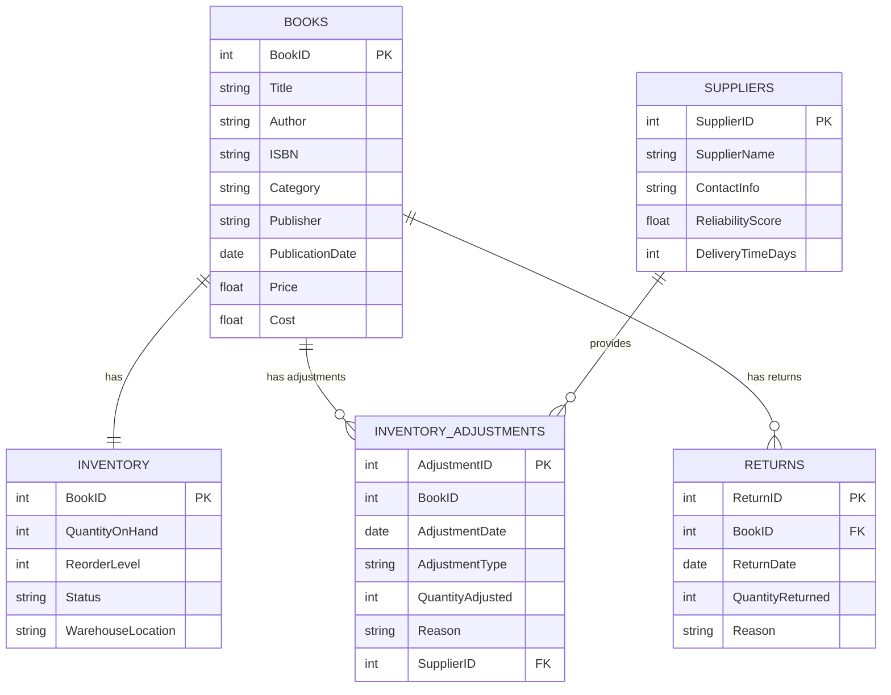

# Bookkeeping Store Database Schema

I have created a toy example of a database for a Bookkeeping Store to manage its inventory, including the ability to handle excess and obsolete inventory, track returns, and evaluate supplier performance.

## **Tables and Relationships**

### **Tables:**

1. **BOOKS**: Stores information about each book available in the store.
2. **INVENTORY**: Keeps track of the quantity of each book on hand, reorder levels, and warehouse locations.
3. **INVENTORY_ADJUSTMENTS**: Records any adjustments made to the inventory, such as new shipments, sales, or obsolescence write-offs.
4. **SUPPLIERS**: Contains details about the suppliers providing books to the store.
5. **RETURNS**: Tracks information about returned books from customers.

### **Relationships:**

- Each book in the `BOOKS` table has one corresponding inventory record in the `INVENTORY` table.
- A book can have zero or more inventory adjustments recorded in the `INVENTORY_ADJUSTMENTS` table.
- Each inventory adjustment can be associated with a supplier from the `SUPPLIERS` table (for purchase-related adjustments).
- Books can have zero or more return records in the `RETURNS` table.

Diagram Explanation:
BOOKS is the central table that connects to all other tables.
INVENTORY: Each book has one inventory record.
INVENTORY_ADJUSTMENTS: Each book can have multiple inventory adjustments. Adjustments related to purchases are linked to SUPPLIERS.
SUPPLIERS: Suppliers provide books, and their performance can be tracked through the INVENTORY_ADJUSTMENTS.
RETURNS: Books can have multiple return records, tracking customer returns.
Usage and Extensions:
This schema can be utilized to simulate inventory management scenarios, analyze excess and obsolete inventory, track returns, evaluate supplier performance, and forecast demand. You can modify or expand upon this data to incorporate additional complexities such as multiple warehouses, detailed supplier contracts, or advanced forecasting models to better suit specific business requirements.
 
Note: Ensure that all foreign key relationships are properly maintained to preserve data integrity across the database.

Explanation of the Tables:
BOOKS:
BookID: A unique identifier for each book (Primary Key).
Title, Author, ISBN, Category, Publisher, PublicationDate, Price, Cost: Additional details about the book.
INVENTORY:
BookID: References the BookID from BOOKS (Primary Key and Foreign Key).
QuantityOnHand: The current stock level.
ReorderLevel: The stock level at which more units should be ordered.
Status: Indicates if the book is active, discontinued, or obsolete.
WarehouseLocation: The physical location of the book in the warehouse.
INVENTORY_ADJUSTMENTS:
AdjustmentID: A unique identifier for each inventory adjustment (Primary Key).
BookID: References the BookID from BOOKS (Foreign Key).
AdjustmentDate: The date of the inventory adjustment.
AdjustmentType: The type of adjustment (e.g., 'Purchase', 'Sale', 'Obsolescence').
QuantityAdjusted: The number of units adjusted (positive for additions, negative for reductions).
Reason: A description or reason for the adjustment.
SupplierID: References the SupplierID from SUPPLIERS (Foreign Key). Allows NULL for non-purchase adjustments.
SUPPLIERS:
SupplierID: A unique identifier for each supplier (Primary Key).
SupplierName: Name of the supplier.
ContactInfo: Contact details for the supplier.
ReliabilityScore: A score indicating the reliability of the supplier (1.0 to 5.0 scale).
DeliveryTimeDays: Average delivery time in days.
RETURNS:
ReturnID: A unique identifier for each return transaction (Primary Key).
BookID: References the BookID from BOOKS (Foreign Key).
ReturnDate: The date the return was processed.
QuantityReturned: The number of units returned.
Reason: The reason for the return.

