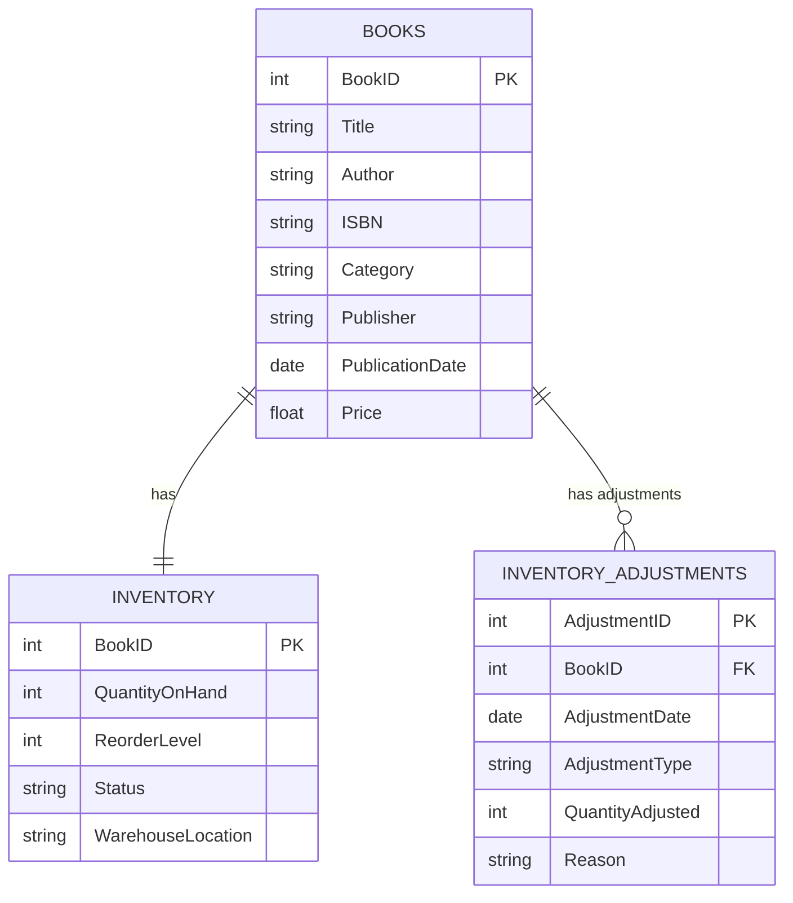

I want to make a toy example of a database for a Bookkeeping Store to manage the inventory, including the ability to handle excess and obsolete inventory.

**Tables and Relationships:**

1. **BOOKS**: This table stores information about each book available in the store.
2. **INVENTORY**: This table keeps track of the quantity of each book on hand, reorder levels, and warehouse locations.
3. **INVENTORY_ADJUSTMENTS**: This table records any adjustments made to the inventory, such as new shipments or obsolescence write-offs.

**Relationships:**

- Each book in the `BOOKS` table has one corresponding inventory record in the `INVENTORY` table.
- A book can have zero or more inventory adjustments recorded in the `INVENTORY_ADJUSTMENTS` table.

With this correction, the Mermaid ER diagram should parse correctly and visually represent the database structure you described.

**Explanation of the Tables:**

- **BOOKS**:
  - **BookID**: A unique identifier for each book (Primary Key).
  - **Title**, **Author**, **ISBN**, **Category**, **Publisher**, **PublicationDate**, **Price**: Additional details about the book.

- **INVENTORY**:
  - **BookID**: References the `BookID` from `BOOKS` (Primary Key and Foreign Key implicitly through the relationship).
  - **QuantityOnHand**: The current stock level.
  - **ReorderLevel**: The stock level at which more units should be ordered.
  - **Status**: Indicates if the book is active, discontinued, or obsolete.
  - **WarehouseLocation**: The physical location of the book in the warehouse.

- **INVENTORY_ADJUSTMENTS**:
  - **AdjustmentID**: A unique identifier for each inventory adjustment (Primary Key).
  - **BookID**: References the `BookID` from `BOOKS` (Foreign Key).
  - **AdjustmentDate**: The date of the inventory adjustment.
  - **AdjustmentType**: The type of adjustment (e.g., addition, subtraction, write-off).
  - **QuantityAdjusted**: The number of units adjusted.
  - **Reason**: A description or reason for the adjustment.

[//]: # (Please write creation SQL scripts for those tables + different script with sample data to insert to be able to reason later about excess and obsolence)

**Explanation of Sample Data:**

**BOOKS Table:**
- **BookID 1**: 'The Great Gatsby' – A classic fiction book with steady demand.
- **BookID 2**: '1984' – A popular dystopian novel with moderate sales.
- **BookID 3**: 'Clean Code' – A programming book, bulk-purchased anticipating high demand.
- **BookID 4**: 'The Lean Startup' – A business book with niche market interest.
- **BookID 5**: 'Obsolete Book' – A book that is outdated and marked obsolete.

**INVENTORY Table:**
- **BookID 1**: High QuantityOnHand due to popularity, with a ReorderLevel set at 50 to trigger restocking before stock depletes.
- **BookID 2**: Lower QuantityOnHand approaching ReorderLevel, indicating the need to monitor stock levels.
- **BookID 3**: Significant QuantityOnHand from a bulk purchase; potential for excess inventory if demand doesn't meet expectations.
- **BookID 4**: Slightly below ReorderLevel; may need to consider restocking soon.
- **BookID 5**: Marked as 'Obsolete' with minimal QuantityOnHand; indicates leftover stock that needs to be managed.

**INVENTORY_ADJUSTMENTS Table:**
- Records all changes to inventory levels, including purchases (stock additions), sales (stock reductions), and obsolescence write-offs.

**Adjustments for BookID 1:**
- Significant sales indicating high demand.
- Restock needed after promotional events.

**Adjustments for BookID 2:**
- Steady sales; monitor to prevent stockouts.

**Adjustments for BookID 3:**
- Large initial purchase; sales are occurring but may not match the volume of stock on hand.

**Adjustments for BookID 4:**
- Smaller market; sales are fewer, so restocking is less frequent.

**Adjustments for BookID 5:**
- Obsolescence write-off reflects the removal of unsellable stock.
- Clearance sale to eliminate remaining units.

**Analyzing Excess and Obsolescence:**

**Excess Inventory Example:**
- **BookID 3 ('Clean Code')**:
  - **QuantityOnHand**: 200 units.
  - **ReorderLevel**: 100 units.
  - **Analysis**:
    - Initial bulk purchase of 300 units (AdjustmentID 1006).
    - Sales of 100 units (AdjustmentID 1007) and 50 units (AdjustmentID 1014).
    - Remaining stock is high relative to sales velocity.
    - Potential excess inventory tying up capital.
  - **Action**: Consider marketing strategies to increase sales or adjust future purchase quantities.

**Obsolescence Example:**
- **BookID 5 ('Obsolete Book')**:
  - **Status**: 'Obsolete'.
  - **QuantityOnHand**: 5 units remaining after write-offs and clearance sales.
  - **Analysis**:
    - Obsolescence write-off of 10 units (AdjustmentID 1010).
    - Clearance sale of 5 units (AdjustmentID 1011).
    - Remaining inventory is minimal but may still incur storage costs.
  - **Action**: Decide whether to donate, recycle, or further discount remaining stock to eliminate holding costs.

**Using the Data for Inventory Management Decisions:**
- **Set Appropriate Reorder Levels**:
  - Analyze sales trends to adjust ReorderLevel ensuring stock availability without overstocking.
- **Identify Slow-Moving Items**:
  - Items with low sales velocity and high QuantityOnHand (e.g., BookID 3) may require action to prevent excess.
- **Manage Obsolete Stock**:
  - Implement strategies for obsolete items to minimize financial losses, such as write-offs or promotions.
- **Demand Forecasting**:
  - Use historical sales data from INVENTORY_ADJUSTMENTS to predict future demand and inform purchasing decisions.
- **Optimize Warehouse Space**:
  - Reduce excess and obsolete inventory to free up space for high-demand items.

By utilizing these scripts and the sample data provided, you can simulate inventory management scenarios, analyze the effects of excess and obsolescence, and develop strategies to optimize inventory levels across your physical shops. Feel free to modify or expand upon this data to better suit specific scenarios or to incorporate additional complexities into your analysis.
